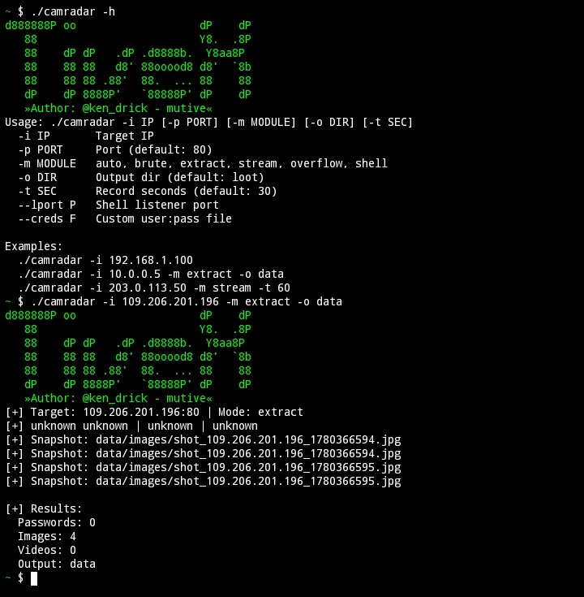

# TiveX
A penetration testing tool for cameras.
# CamRadar v3.0 - Adaptive IoT Security Assessment Tool

CamRadar is an advanced penetration testing and security auditing tool designed to automate

the process of environment detection, credential auditing, and vulnerability assessment on IP

cameras and Digital Video Recorders (DVR/NVR).

## ⚠️ Legal Disclaimer

**IMPORTANT NOTICE:** This tool is developed and distributed **STRICTLY FOR

EDUCATIONAL PURPOSES, RESEARCH, AND AUTHORIZED SECURITY AUDITING**.

* Using this software to scan, test, or exploit any network, system, or device without prior explicit

written authorization from the owner is a **SERIOUS CRIMINAL OFFENSE** under

cybersecurity laws worldwide.

* The author assumes absolutely no liability and is not responsible for any misuse, damage,

data loss, or legal consequences caused by the operation of this tool.

* By compiling or running CamRadar, you agree to take full responsibility for your actions and

comply with all local and international regulations.


## ️ Core Functional Architecture

The tool automates the standard offensive security lifecycle for IoT assessment through the

following modules:

* **Adaptive Environment Detection:** Inspects system headers and environment variables at

runtime to determine the host architecture (Linux PC vs Termux/Android), dynamically

optimizing resource allocation and available libraries.

* **Active Fingerprinting:** Analyzes HTTP response bodies and banners against an embedded

signature matrix to identify the vendor (e.g., Hikvision, Dahua, Axis, Tapo), specific hardware

model, firmware generation, and CPU architecture (ARM/MIPS/x86).

* **Automated Credential Auditing:** Conducts smart brute-force testing against the target

service leveraging curated default credential lists tailored to the specific identified vendor.

* **Configuration & Media Exfiltration:** Simulates data exposure risks by targeting common

firmware backup paths, extracting unauthenticated JPEG snapshots, and capturing live RTSP

video streams via sub-process abstraction (FFmpeg).

* **Vulnerability Simulation:** Conducts standard service resilience checks via buffer overflow

payload generation and sets up an asynchronous socket handler (`shell_listener`) to catch

incoming reverse shell connections.
## 🚀 Compilation & Deployment Guide

### Prerequisites

Ensure all required system dependencies and development headers are installed before

compilation:

* **Linux Distribution (Ubuntu/Debian PC):** *
```bash

sudo apt update && sudo apt install -y g++ libcurl4-openssl-dev libssl-dev libpcap-dev ffmpeg

```

* **Termux (Android Non-Rooted Environment):** *
```bash

pkg update && pkg install -y clang libcurl-dev openssl-dev ffmpeg

```

### Compilation Commands

* **For Laptop/PC (Full Feature Set with PCAP integration):**

```bash

g++ -O3 -o camradar camradar.cpp -lpthread -lcurl -lssl -lcrypto -lpcap -std=c++11

```

* **For Termux (Optimized Linker Flags to Avoid Android Errors):**

```bash

g++ -O3 -o camradar camradar.cpp -lpthread -lcurl -lssl -lcrypto -std=c++11

```

## 📖 Usage & Technical Examples

Before execution, grant binary execution permissions: `chmod +x camradar`

### 1. View Help Menu and Options

```bash

./camradar -h

2. Standard Automated Inspection (Default Mode)

./camradar -i 192.168.1.100

3. Target Configuration Extraction with Custom Output Directory

./camradar -i 10.0.0.5 -m extract -o /path/to/secure_loot

4. Live Stream Exfiltration Testing (RTSP Capture for 60 Seconds)

./camradar -i 203.0.113.50 -m stream -t 60

5. Multi-Module Audit with Custom Wordlist & Reverse Shell Handler

./camradar -i 192.168.1.150 -p 8080 -m shell --lport 4444 --creds custom_pass.txt
```
# IMG
<p align="center">
  
</p>

